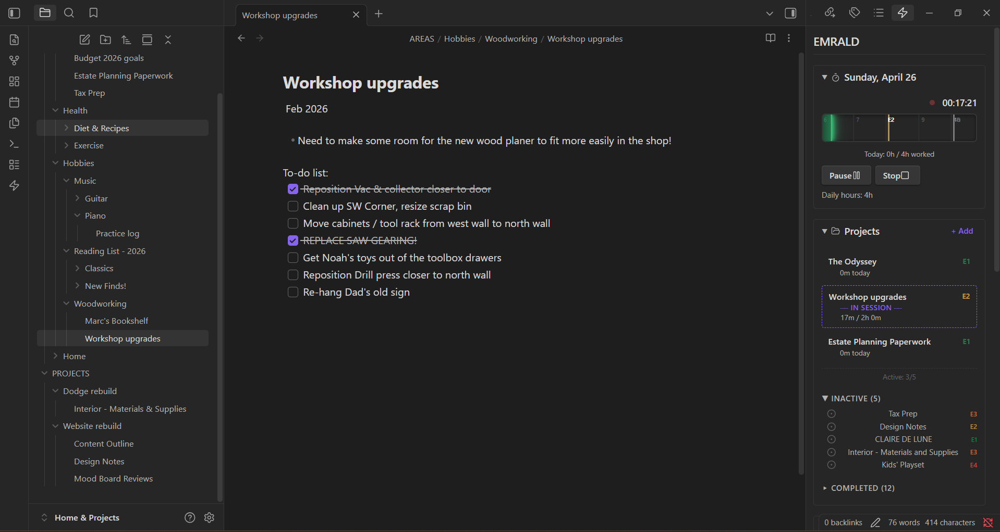
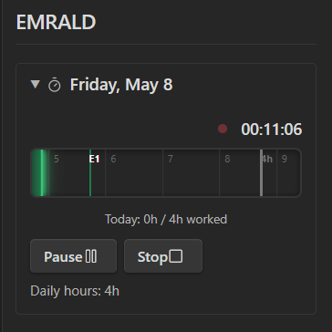
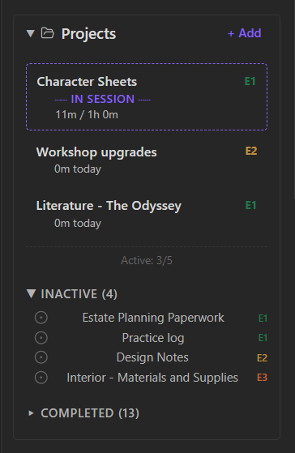
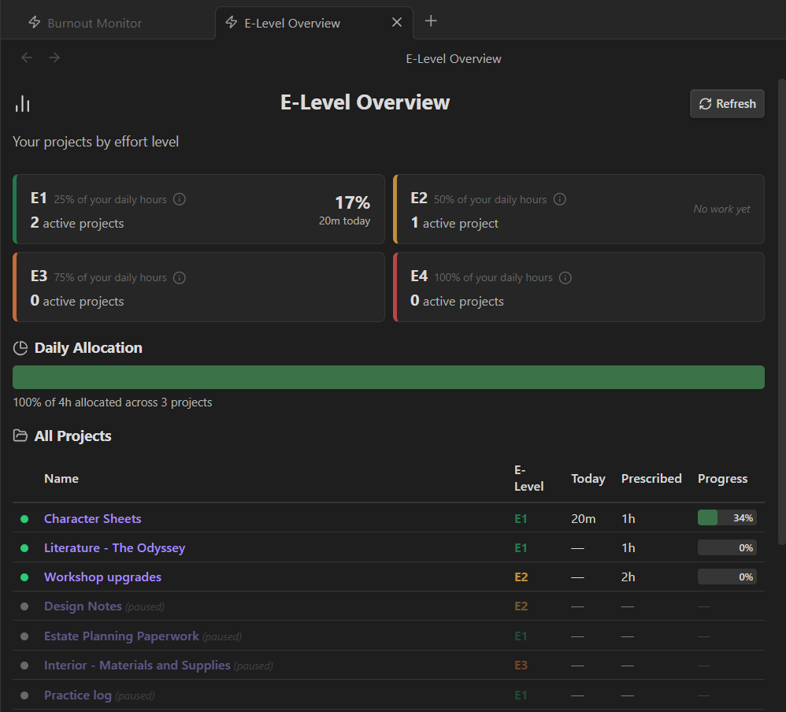
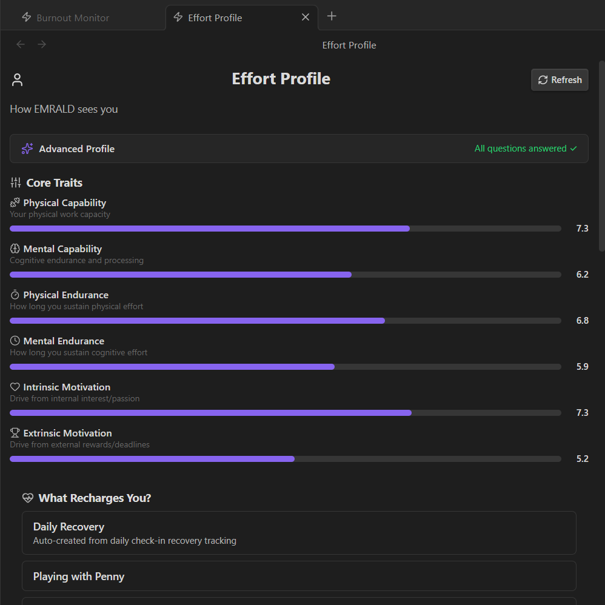
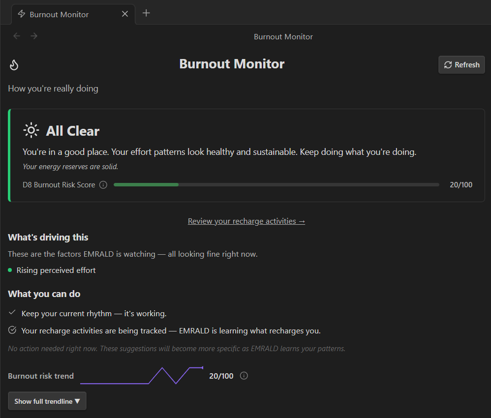

# EMRALD for Obsidian

**Track what work costs you, not just what you finish.**



EMRALD is an effort management plugin for Obsidian. It helps you track patterns around effort, flow, energy, recovery, and burnout risk without leaving the notes and projects you already rely on.

Most productivity tools can tell you what got done.
EMRALD is built to help you understand what the work actually **cost** you.

---

## Why EMRALD exists

A task list can say you're doing fine while your actual capacity says otherwise.

EMRALD was built for that gap.

Instead of forcing you into a brand-new productivity system, it adds an effort-aware layer to Obsidian so you can keep the workflow you already trust and gain a clearer picture of how your work affects you over time.

**Keep your stuff. We'll make it smarter.**

---

## What it does

- Track focused work sessions from inside Obsidian
- Capture quick post-session effort receipts
- Record daily check-ins around energy and readiness
- Monitor patterns in effort, flow, and recovery over time
- Surface burnout-related signals before they become obvious
- Keep project and effort awareness close to your notes
- Work alongside your vault instead of replacing it

---

## Who it's for

EMRALD is especially useful if you:
- already manage work or life systems inside Obsidian
- want more than time tracking or task completion
- regularly feel "productive" but still end the day cooked
- care about sustainable output, not just maximum output
- want your system to reflect real capacity, not fantasy capacity

---

## Screenshots

### The sidebar — your daily workspace
Timeblock timer, projects, and effort tools — always one click away.

| Timeblock (active session) | Projects |
| :---: | :---: |
|  |  |

### The workspace views — your patterns over time

**E-Level Overview** — see how your day breaks down across effort tiers.


**Effort Profile** — how EMRALD sees your capacity, endurance, and motivation.


**Burnout Monitor** — sustained-effort signal watching, before patterns get obvious.


_Screenshots show dark mode. EMRALD adapts to your active Obsidian theme._

### See it in action

A full session flow — Start → work → Stop → Effort Receipt:


---

## Getting started

1. Create an account at **app.effortmastery.com**
2. Sign in and generate your API key
3. Install the EMRALD plugin in Obsidian
4. Open EMRALD settings and paste in your API key
5. Start your first session

If this is your first time using EMRALD, expect the value to build over time.
The first few sessions establish the baseline. The pattern recognition gets stronger as the data accumulates.

---

## Companion theme

The optional **EMRALD Theme** is the official companion theme for the plugin.
It is built to match the workspace visually, but it is completely optional and can stand on its own.

---

## Privacy / note safety

EMRALD is designed to work alongside your Obsidian workflow without taking over your notes.
Its integration is built around metadata and plugin-managed state rather than rewriting your note content.

---

## Development

```bash
npm install
npm run dev
```

### Build

```bash
npm run build
```

---

## License

MIT — Effort Mastery LLC
